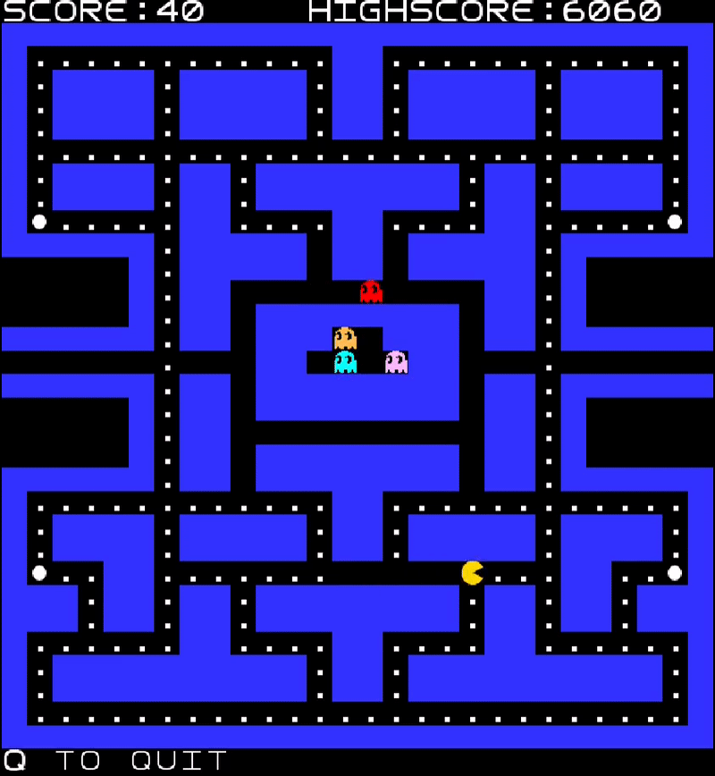
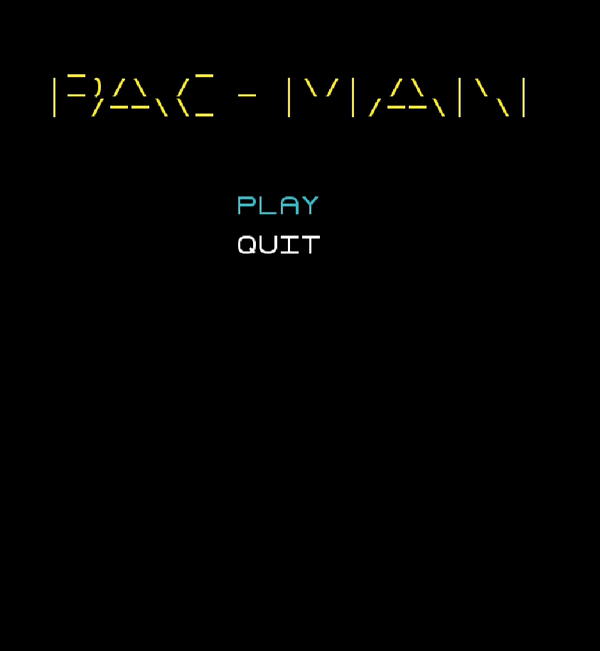

# What is this?
This repository is a mirror of the original private repository where this project was made.

It's the final project for the Laboratório de Desenho e Teste de Software UC in the second year of LEIC at FEUP.

If you are using Arch Linux (which I am btw), the audio will probably make your program crash. If it doesn't, please tell me about it...

Everything else is the original README.

## LDTS_11_05 - PACMAN

In this project, we developed a pacman clone written in Java with the GUI Framework "Lanterna". In it, you control pacman through the arena collecting all the PacDots and PowerPellets you can while being chased by 4 different enemy characters.

This game was developed by Tomás Pinto Macedo (up202108811@fe.up.pt), Davide Pinto Teixeira (up202109860@fe.up.pt) and Emanuel Rui Tavano Maia (up202107486@fe.up.pt) for LDTS 2022⁄23.

You can find more details about the development of the game [here](docs/README.md).

## Screenshots

The following screenshots illustrate the general look of our game, as well as the divergent functionalities:
### Game preview

  

  <b><i>Gif 1. Sneak peek into the game</i></b>

 
 

### Menu

  

  <b><i>Gif 2. Main Menu</i></b>

 
 

### Chased State

  

  <b><i>Gif 3. Ghost State after Pacman eats a Power Pellet</i></b>

 
 

