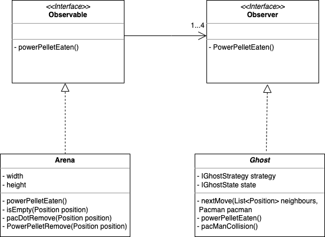

## LDTS_11_05 - PACMAN

In this project, we developed a pacman clone written in Java with the GUI Framework "Lanterna". In it, you control pacman through different arenas collecting all the PacDots and PowerPellets you can while being chased by 4 different enemy characters.

This game was developed by Tomás Pinto Macedo (up202108811@fe.up.pt), Davide Pinto Teixeira (up202109860@fe.up.pt) and Emanuel Rui Tavano Maia (up202107486@fe.up.pt) for LDTS 2022⁄23.

### IMPLEMENTED FEATURES

- **Menu** - An introductory screen that appears when the game is booted, it displays the name of the game and allows you to start the level when the "Play" option is selected or exit the game when the "Quit" option is selected by pressing the "ENTER" key.
- **Player Character** - The player character (Pacman) will be able to move in 4 different directions depending on the key that is pressed: UP, when "W" is pressed, DOWN, when "S" is pressed, LEFT, when "A" is pressed and RIGHT, when "D" is pressed.
- **Enemy Characters** - There are 4 enemy characters (Ghosts) which will chase Pacman until capture if in HunterState or run away from Pacman if in ChasedState. In the case of them being in HouseState or in EatenState they'll  be unreachable by Pacman.
- **Level** - An arena through which the player will collect PacDots and PowerPellets while escaping the ghosts.
- **PacDots** - Pacman can eat PacDots laid throughout the arena, increasing the score the player has. When the arena is fully cleared of PacDots, the player will reach the high score, beating the game and return to the main menu.
- **PowerPellets** - These have all the features of normal PacDots, but, in addition of that, will cause the ghosts to change from HunterState to ChasedState through an ObserverPattern, during which Pacman will be able to eat ghosts.
- **Game Over** - When Pacman is caught by the Ghosts, a death sound will play, and you will be brought back to the main menu.

### PLANNED FEATURES
- **Multiple Levels** - Initially there were plans for multiple levels in the game.

### DESIGN

### The Architecture

**Problem in Context:**

Since we wanted to have a game that implements independently the objects in the game, the entity that manipulates them and the way the game is shown to the user, we realized that we would need to implement a specific architecture for our game.

**Implementation:**

The MVC architecture is implemented this way:

  

  <b><i>Fig 1. MVC architecture UML</i></b>

**The Pattern:**

To solve this problem, we decided to use MVC Architecture. MVC means Model, Viewer, Controller, respectively. The model stores the data of the game and has methods that allows the controller to manipulate them. In its turn, the controller has implemented the logic of the game and is the entity that is responsible for use the data from the model, coherently. The viewer has two main functionalities. The first one, is to show to the player what is happening in the game. The second one, is to read the input that is given by the player and send it to the controller.

#### THE GHOSTS NEED TO CHANGE THEIR STATE WHEN PACMAN EATS A POWERPELLET

**Problem in Context**

We needed a way for ghosts to immediately know if pacman has eaten a PowerPellet. And it wouldn't be efficient for the ghosts to continually check if this has happened.

**The Pattern**

To achieve this we decided to use an Observer Pattern. The PowerPellets are laid throughout the Arena, therefore if the arena is an observable entity, the ghosts, as observers, can be immediately notified of this and change to the ChasedState.

**Implementation**

  

  <b><i>Fig 2. Observer Pattern UML</i></b>

**Consequences**

The use of the Observer Pattern prevents the Ghosts from having to constantly have to check the Arena for any changes to it.

- [Arena](../pacman/src/main/java/org/l11gr05/model/arena/Arena.java)
- [Observable](../pacman/src/main/java/org/l11gr05/model/arena/IArenaObservable.java)
- [Observer](../pacman/src/main/java/org/l11gr05/model/elements/ghost/IArenaObserver.java)
- [Ghost](../pacman/src/main/java/org/l11gr05/model/elements/ghost/Ghost.java)

#### WE NEED AN INTERFACE FOR LANTERNA

**Problem in Context**

Lanterna is a complex library, and as such we need a way to interface with it more easily.

**The Pattern**

The best way to do this, is by using the Facade Pattern. This structural design pattern provides a simplified interface to any complex subsystem.

**Implementation**

  

  <b><i>Fig 3. FacadePattern UML</i></b>

**Consequences**

With this design pattern we can just use the features we need through the class we created.

- [Game](../pacman/src/main/java/org/l11gr05/Game.java)
- [GUI](../pacman/src/main/java/org/l11gr05/gui/GUI.java)
- [LanternaGUI class](../pacman/src/main/java/org/l11gr05/gui/LanternaGUI.java)

#### THERE NEEDS TO BE A WAY TO CONTINUOUSLY PROCESS USER INPUT AND GAME STATE

**Problem in Context**

There needs to be a way to continually check for any inputs the player might make, as well as a way to track the state without being affected by processor speed

**The Pattern**

One can achieve this with the Game Loop Pattern. Through this, with each turn of the loop, you can process user input and update the game state.

**Consequences**

The game time can be tracked independently of processor speed and, therefore, process user input without blocking and continuously update the game state.

#### WE NEED A STATE FOR BOTH IN-GAME AND MENU

**Problem in Context**

We need a way for the game to behave in a different way depending on whether it's in-game or in a menu.

**The Pattern**

The best way for this to be efficiently achieved is through a State Pattern.

**Consequences**

Through this you can have different states for game and menu, which allows one to easily change the behaviour of the game depending on the situation.

**Implementation**

  

  <b><i>Fig 5. State Pattern UML for the game and menu</i></b>

#### THE GHOSTS NEED TO MOVE IN TANDEM WITH THEIR STATES

**Problem in Context**

We need a way for the ghosts to move in a different way depending on whether their state.

**The Pattern**

The best way for this to be efficiently achieved is through a State Pattern.

**Consequences**

This way, their state can be implemented in a way that is coherent with their movement.

**Implementation**

  

  <b><i>Fig 6. State Pattern UML for the Ghost states</i></b>

#### EACH GHOST NEEDS TO BEHAVE DIFFERENTLY FROM EACH OTHER

**Problem in Context**

There needs to be a way for each ghost to both share some movement code and states and still behave in a different way without creating redundant code.

**The Pattern**

With a Strategy Pattern, one can keep shared context, while still allowing for different behaviour.

**Consequences**

This way one can easily create different behaviour for each ghost without requiring redundant code.

**Implementation**

  

  <b><i>Fig 7. Strategy Pattern UML</i></b>

#### IMPLEMENTATION

This UML shows how all design patterns we used were mapped to our different classes.

  

  <b><i>Fig 8. Complete UML</i></b>

### KNOWN CODE SMELLS AND REFACTORING SUGGESTIONS

## Testing

### Screenshot of coverage report

  

  <b><i>Fig 9. Code coverage screenshot</i></b>

### Link to mutation testing report
[Mutation tests](https://paginas.fe.up.pt/~up202109860/)

### SELF-EVALUATION

- Tomás Macedo: 33%
- Davide Teixeira: 34%
- Emanuel Maia: 33%
